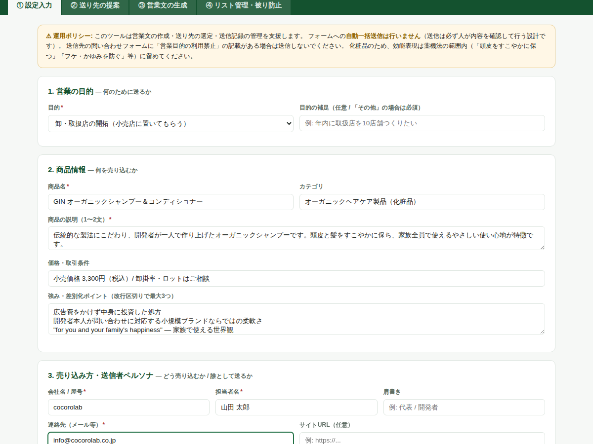
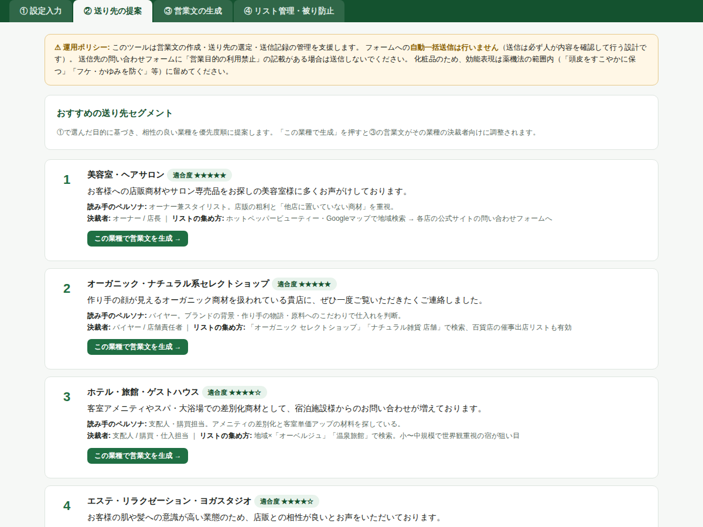
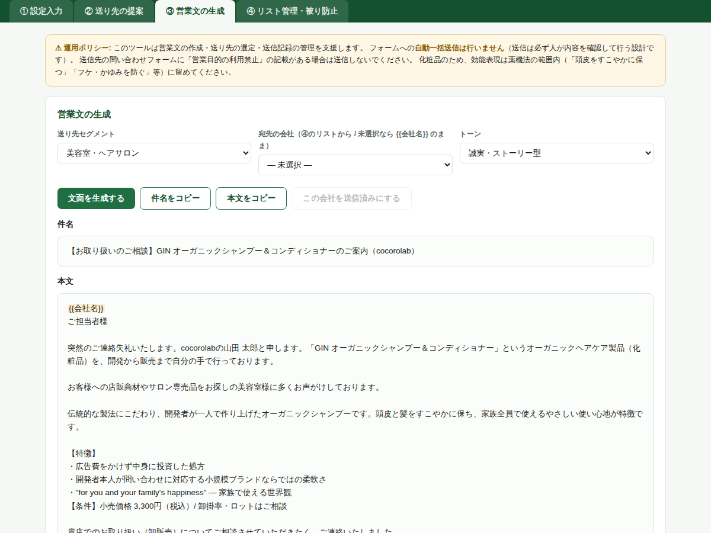

# フォーム営業オプティマイザー

企業の問い合わせフォーム経由の営業（フォーム営業）を支援するビジネスツールです。
「どんな目的で・何を商品として・どのように売り込むのか」を入力すると、**最適化された営業文**と**誰に送るといいのかの提案**を出力します。リスト被り防止・ペルソナ設定つき。

## 🚀 使う

**ブラウザですぐ使う（GitHub Pages）:**

👉 **https://mochamofu.github.io/business-tool-for-sales/**

またはこのリポジトリをダウンロードして `index.html` をブラウザで開くだけでも動きます（インストール・サーバー不要）。入力したデータはお使いのブラウザのローカルストレージにのみ保存されます。

## 画面と機能

### ① 設定入力 — 目的・商品・売り込み方・ペルソナ

目的（卸開拓 / サロン導入 / コラボ / ギフト / EC出品）、商品情報、送信者ペルソナ（会社・担当者・トーン・CTA）を入力フォーマットに沿って入力します。

### ② 送り先の提案 — 誰に送るといいのか

目的に応じて相性の良い業種10セグメントを適合度順に提案。各セグメントに「読み手のペルソナ・決裁者・リストの集め方」を併記します。

### ③ 営業文の生成 — 最適化されたフォーム営業文

入力とセグメントに合わせた件名＋本文（500〜700字）を3トーン（誠実・ストーリー型 / 簡潔・提案型 / 相手起点型）で生成。宛先会社を選ぶと会社名を自動差し込みし、コピーしてフォームに貼り付けるだけです。

**Claude連携でさらに最適化:**
- 方法A: 全設定＋宛先情報入りの最適化プロンプトをワンクリック生成 → [claude.ai](https://claude.ai) に貼り付け
- 方法B: Anthropic APIキーを入力してブラウザから直接生成（モデル: `claude-opus-4-8`。キーはブラウザ内でのみ使用され、「キーを保存」時のみこの端末に保存。共有PCでは保存しないでください）

### 🔎 候補リサーチ — 送り先そのものを探す（④タブ内）

「どこに売るか」の候補企業そのものを探せます。

- **Claude APIで自動リサーチ**: 業種・件数・地域を選ぶと、ClaudeがWeb検索で実在の候補事業者を探し、「なぜこの店が合いそうか」の提案理由つきでリストに自動追加（重複は自動スキップ）
- **リサーチ用プロンプトのコピー**: APIキーがなくても、プロンプトをclaude.ai（Web検索オン）に貼れば同じリサーチができ、結果を追加欄に貼り戻すだけ
- **スターター候補リスト**: 調査済みの実在候補（オーガニック系セレクトショップ / 自然派美容室 / エステ・ヨガ / 産後ケア・ベビー / ホテル / ギフト事業者など約100件、提案理由つき）をワンクリックで読み込み。元データは [`data/starter-candidates.tsv`](data/starter-candidates.tsv)、一覧は [`docs/candidates.md`](docs/candidates.md)

> 候補はWeb検索に基づく参考情報です。送信前に必ず各社のサイトを確認し、「営業目的の問い合わせ禁止」の記載がある場合は送らないでください。

### ④ リスト管理・被り防止

- 会社リストを貼り付けて一括登録。**「株式会社 /（株）/ ㈱」等の表記ゆれ・全半角を正規化し、既存リスト・送信済みとの重複を自動スキップ**
- URLのドメインでも重複照合
- 送信済み / 返信あり / NG（送らない）のステータス管理
- 日次送信数カウンタ・返信数の集計・CSVエクスポート

## 毎日の運用フロー

1. **①設定入力**（初回のみ）— 目的・商品・売り方・送信者情報を保存
2. **②送り先の提案** — 攻める業種を決め、「リストの集め方」を参考に会社リストを収集
3. **④リスト管理** — 集めた会社を貼り付けて登録（重複は自動で弾かれる）
4. **③営業文の生成** — 宛先会社を選んで文面生成 → Claudeで最適化 → コピーして相手のフォームに貼り付け、内容を確認して送信
5. 送信したら「送信済みにする」を押す（被り防止リストに記録）
6. 返信が来たら「返信あり」、お断りされた企業は「NG」にして再送を防止

## 運用上の注意

- 送信は必ず人が内容を確認して行ってください（本ツールに自動送信機能はありません）
- 問い合わせフォームに「営業目的の利用禁止」の記載がある場合は送信しないでください
- 化粧品を扱う場合、効能表現は薬機法の範囲内で（生成ルールに組み込み済み。「治る・生える・改善」はNG、「すこやかに保つ・防ぐ・うるおいを与える」まで）

## カスタマイズ

- 送り先セグメント（業種・ペルソナ・適合度スコア）: `index.html` 内の `SEGMENTS` 配列
- 営業文テンプレート: `buildMessage()` / Claude用プロンプト: `buildClaudePrompt()`
- 商品情報の初期値はGINオーガニックシャンプーになっていますが、①の画面で自由に書き換えられます
